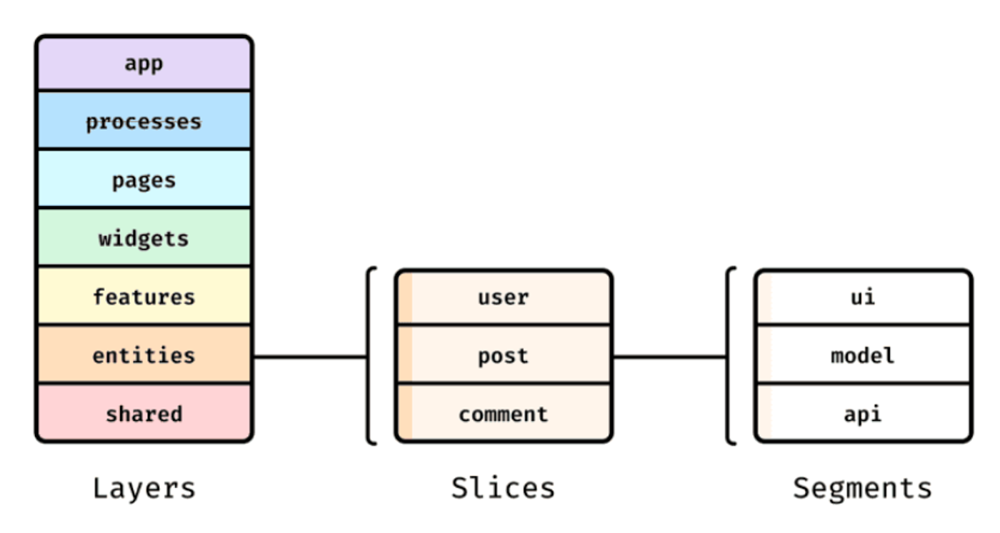
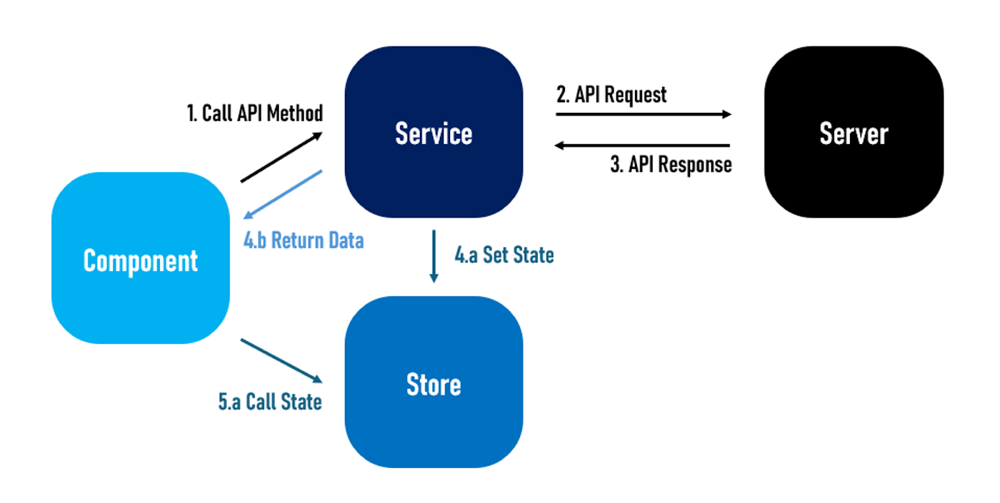

# StoryTune Client
> 2024-2 CAU CapstoneDesign
 

## 🐥 Service Info

 

#### ✨ 나만의 이야기를 만들고, 친구들과 함께 롤플레잉을 해봐요! ✨

 

 

## 👩‍💻 Contributors

<table>
  <tbody>
      <td align="center"><a href="https://github.com/hyeonsoo0625"> <b>FE : 김현수 </b></a> </td>
      <td align="center"><a href="https://github.com/Jihaeee"> <b>FE : 강지혜 </b></a> </td>
  </tbody>
</table>

 

## ⚒️ Tech Stack

        

 

 

## 🍀 Infra Architecture

 

## 📝 Project Architecture

Client는 FSD Architecture를 기반으로 개발했습니다.
  

## 📚 Library
- **Core |** React / TypeScript
- **Cache Management |** React Query
- **State Management |** Zustand
- **Style |** Emotion
- **Package Management |** Npm
- **Build |** Vite
- **Mocking |** MSW

 

<a href="#readme-top">back to top</a>
